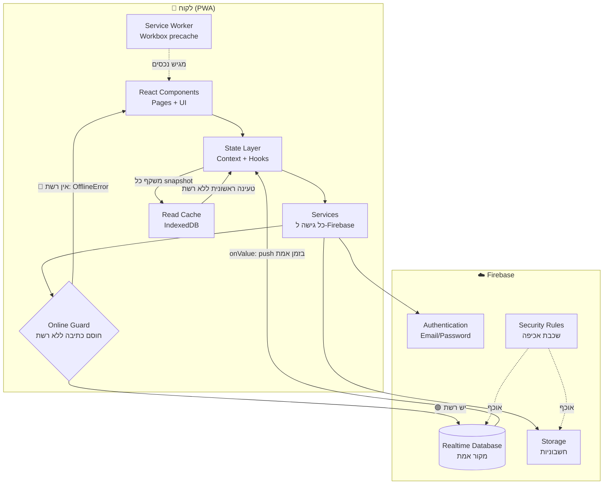
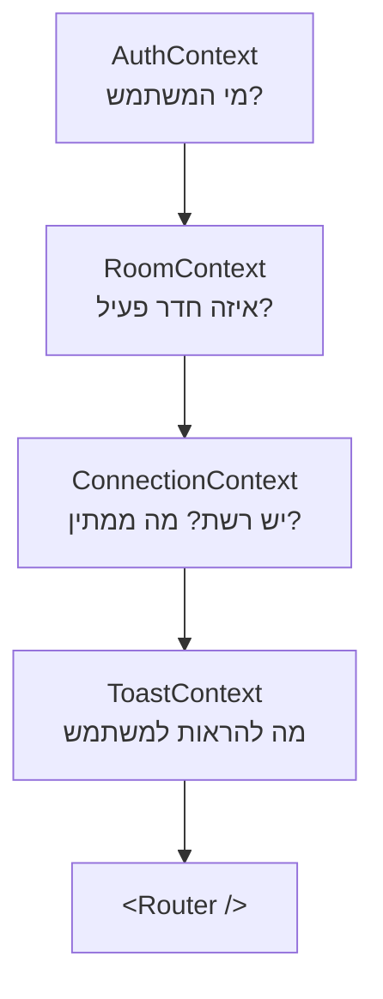
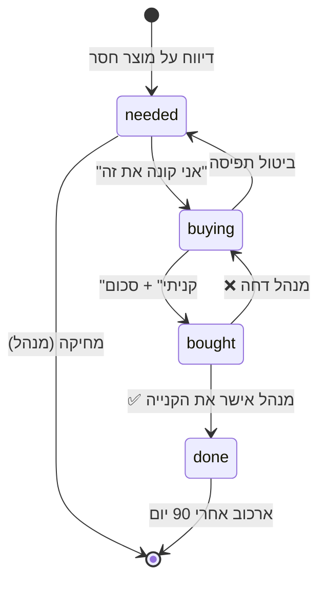
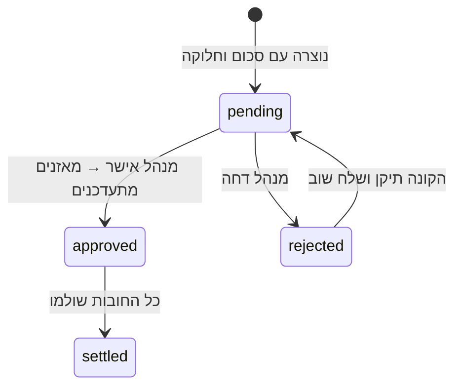

# 01 · ארכיטקטורה ומבנה הפרויקט

---

## 1. תמונת על



### עקרון מפתח: כיוון זרימת הנתונים

הכתיבה והקריאה **אינן** אותו מסלול:

```
כתיבה:  UI → Service → Online Guard → Firebase        (נחסמת ללא רשת)
קריאה:  Firebase → onValue → Context → UI
                      ↓
                 Read Cache (IndexedDB)  →  מוזרם חזרה ל-UI כשאין רשת
```

ה-UI **לעולם לא** מעדכן את עצמו ישירות מתוצאת הכתיבה. הוא כותב, ואז מחכה שההאזנה תחזיר את הנתון. כך משתמש A ומשתמש B רואים בדיוק את אותו זרם עדכונים, ואין שני מסלולים שיכולים להסתנכרן לא נכון.

**האסימטריה מכוונת:** הקריאה שורדת ניתוק רשת, הכתיבה לא. זו ההחלטה המרכזית של מודל האופליין שלנו — ראו [05-offline-pwa.md](./05-offline-pwa.md).

---

## 2. שכבות המערכת

| שכבה | תיקייה | אחריות | **אסור** לה |
|------|--------|--------|-------------|
| **Presentation** | `components/`, `pages/` | JSX, אינטראקציה, עיצוב | לייבא `firebase/*` |
| **State** | `store/`, `hooks/` | האזנות, cache, סטייט גלובלי | להכיל לוגיקה עסקית |
| **Service** | `services/` | כל קריאה/כתיבה ל-Firebase | להכיר React |
| **Domain** | `lib/`, `types/` | חישובי כסף, ולידציה, פורמט | לגעת ב-I/O |
| **Infra** | `config/`, `sw/` | אתחול SDK, Service Worker | — |

### חוק הייבוא היחיד

> **אף קובץ ב-`components/` או ב-`pages/` לא מייבא `firebase/*`. אף פעם.**

זה החוק שהכי משתלם לאכוף. הוא מאפשר לבדוק כל קומפוננטה בלי אמולטור, ומאפשר להחליף את Firebase בעתיד בלי לגעת ב-UI. אכיפה אוטומטית ב-ESLint:

```js
// eslint.config.js
{
  files: ['src/components/**', 'src/pages/**'],
  rules: {
    'no-restricted-imports': ['error', {
      patterns: [{
        group: ['firebase/*'],
        message: 'גישה ל-Firebase מותרת רק דרך src/services/. ראה docs/01-architecture.md'
      }]
    }]
  }
}
```

---

## 3. מבנה תיקיות מלא

```
roomProject/
│
├── public/
│   ├── icons/
│   │   ├── icon-192.png              # PWA
│   │   ├── icon-512.png
│   │   ├── icon-maskable-512.png     # Android adaptive icons
│   │   └── apple-touch-icon-180.png  # iOS
│   ├── favicon.svg
│   └── offline.html                  # fallback לניווט ללא רשת
│
├── src/
│   ├── main.tsx                      # נקודת כניסה + רישום SW
│   ├── App.tsx                       # ספקי Context + Router
│   ├── router.tsx                    # הגדרת כל ה-routes
│   │
│   ├── config/
│   │   ├── firebase.ts               # אתחול SDK + חיבור לאמולטורים
│   │   └── constants.ts              # קטגוריות, עדיפויות, מגבלות
│   │
│   ├── types/
│   │   ├── models.ts                 # Room, Item, Purchase, Member...
│   │   └── schemas.ts                # סכימות zod (מקור הטיפוסים)
│   │
│   ├── lib/                          # ⚡ פונקציות טהורות — 100% נבדקות
│   │   ├── money.ts                  # אגורות, splitEqual/Percentage/Custom
│   │   ├── settle.ts                 # אלגוריתם מזעור העברות
│   │   ├── balances.ts               # חישוב מאזנים מיומן הקניות
│   │   ├── roomCode.ts               # יצירת קוד + נרמול שם חדר
│   │   ├── validators.ts             # בדיקות קלט
│   │   ├── format.ts                 # ₪, תאריכים בעברית
│   │   └── cache.ts                  # מטמון קריאה ב-IndexedDB
│   │
│   ├── services/                     # 🔌 השכבה היחידה שמכירה Firebase
│   │   ├── authService.ts
│   │   ├── roomService.ts
│   │   ├── memberService.ts
│   │   ├── itemService.ts
│   │   ├── purchaseService.ts
│   │   ├── balanceService.ts
│   │   ├── notificationService.ts
│   │   ├── storageService.ts
│   │   └── guard.ts                  # assertOnline — שומר הכתיבה
│   │
│   ├── store/
│   │   ├── AuthContext.tsx           # משתמש מחובר + טעינה
│   │   ├── RoomContext.tsx           # חדר פעיל + חברים + הרשאות
│   │   ├── ConnectionContext.tsx     # online/offline + זמן סנכרון אחרון
│   │   └── ToastContext.tsx          # הודעות למשתמש
│   │
│   ├── hooks/
│   │   ├── useAuth.ts
│   │   ├── useRoom.ts
│   │   ├── useRtdbValue.ts           # hook גנרי להאזנה לצומת
│   │   ├── useRtdbList.ts            # hook גנרי לרשימה
│   │   ├── useItems.ts
│   │   ├── usePurchases.ts
│   │   ├── useBalances.ts
│   │   ├── useJoinRequests.ts
│   │   ├── useNotifications.ts
│   │   ├── useIsAdmin.ts
│   │   └── useOnlineStatus.ts
│   │
│   ├── components/
│   │   ├── ui/                       # אטומים חסרי לוגיקה עסקית
│   │   │   ├── Button.tsx  Input.tsx  Select.tsx  Textarea.tsx
│   │   │   ├── Modal.tsx   BottomSheet.tsx  Badge.tsx  Avatar.tsx
│   │   │   ├── Spinner.tsx Skeleton.tsx  EmptyState.tsx
│   │   │   ├── Toast.tsx   ConfirmDialog.tsx  MoneyInput.tsx
│   │   │   └── PullToRefresh.tsx
│   │   │
│   │   ├── layout/
│   │   │   ├── AppShell.tsx           # מעטפת קבועה
│   │   │   ├── TopBar.tsx
│   │   │   ├── BottomNav.tsx          # ניווט מובייל — 5 טאבים
│   │   │   ├── OfflineBanner.tsx      # "אתה במצב לא מקוון — צפייה בלבד"
│   │   │   ├── StaleDataNotice.tsx    # "נתונים מ-14:32, ייתכן שהשתנו"
│   │   │   └── InstallPrompt.tsx      # באנר התקנת PWA
│   │   │
│   │   ├── auth/
│   │   │   ├── LoginForm.tsx  RegisterForm.tsx
│   │   │   ├── ForgotPasswordForm.tsx  AvatarUploader.tsx
│   │   │   └── ProtectedRoute.tsx     # שומר סף לניתוב
│   │   │
│   │   ├── rooms/
│   │   │   ├── CreateRoomForm.tsx  JoinRoomForm.tsx
│   │   │   ├── RoomCodeCard.tsx       # תצוגה + העתקה + שיתוף
│   │   │   ├── MemberList.tsx  MemberRow.tsx
│   │   │   ├── JoinRequestCard.tsx    # אישור/דחייה
│   │   │   └── RoomSettingsForm.tsx
│   │   │
│   │   ├── items/
│   │   │   ├── ItemList.tsx  ItemCard.tsx
│   │   │   ├── ReportItemForm.tsx
│   │   │   ├── CategoryPicker.tsx  PriorityBadge.tsx
│   │   │   ├── ItemStatusFlow.tsx     # אני קונה / קניתי
│   │   │   └── DuplicateItemWarning.tsx
│   │   │
│   │   ├── purchases/
│   │   │   ├── PurchaseForm.tsx
│   │   │   ├── SplitSelector.tsx      # שווה / אחוז / מותאם
│   │   │   ├── SplitPreview.tsx       # "כל אחד: ₪6.67"
│   │   │   ├── ReceiptUploader.tsx
│   │   │   ├── PurchaseCard.tsx
│   │   │   └── ApprovalQueue.tsx      # תור אישורי מנהל
│   │   │
│   │   ├── balances/
│   │   │   ├── BalanceCard.tsx        # "מגיע לך ₪34.20"
│   │   │   ├── BalanceMatrix.tsx      # מי חייב למי
│   │   │   ├── SettleUpDialog.tsx
│   │   │   └── ExpenseReport.tsx
│   │   │
│   │   └── notifications/
│   │       ├── NotificationBell.tsx
│   │       └── NotificationList.tsx
│   │
│   ├── pages/
│   │   ├── LoginPage.tsx  RegisterPage.tsx  ForgotPasswordPage.tsx
│   │   ├── OnboardingPage.tsx  CreateRoomPage.tsx  JoinRoomPage.tsx
│   │   ├── PendingApprovalPage.tsx
│   │   ├── DashboardPage.tsx  ItemsPage.tsx  ItemDetailPage.tsx
│   │   ├── PurchasesPage.tsx  PurchaseDetailPage.tsx
│   │   ├── BalancesPage.tsx  MembersPage.tsx
│   │   ├── RoomSettingsPage.tsx  ProfilePage.tsx
│   │   └── NotFoundPage.tsx
│   │
│   ├── sw/
│   │   ├── sw.ts                     # Service Worker מותאם
│   │   └── firebase-messaging-sw.js  # FCM (שלב 7)
│   │
│   └── styles/
│       └── index.css                 # Tailwind + משתני CSS + RTL
│
├── tests/
│   ├── unit/                         # lib/ — כיסוי 100%
│   ├── rules/                        # Security Rules מול אמולטור
│   └── e2e/                          # Playwright
│
├── docs/                             # ← אתה כאן
│
├── database.rules.json               # Security Rules של RTDB
├── storage.rules
├── firebase.json
├── .firebaserc
├── .env.local                        # 🚫 לא נכנס ל-git
├── .env.example                      # ✅ נכנס ל-git
├── vite.config.ts
├── tailwind.config.js
├── tsconfig.json
└── package.json
```

---

## 4. מודל הנתונים

### 4.1 העץ המלא ב-RTDB

מבוסס על המפרט, עם ארבע תוספות שהמפרט לא כלל ובלעדיהן המערכת לא עובדת (מסומנות 🆕):

```
firebase-root/
│
├── users/{userId}
│     ├── email          : string
│     ├── displayName    : string
│     ├── avatar         : string | null   (URL ב-Storage)
│     ├── createdAt      : number          (ms)
│     ├── lastActiveAt   : number   🆕     (לזיהוי חשבונות רדומים)
│     └── rooms/{roomCode} : true          ← map, לא array!
│
├── roomCodes/{ROOMCODE}          🆕  אינדקס ציבורי לקריאה בלבד
│     ├── name       : string           מאפשר לבדוק "האם הקוד קיים?"
│     ├── adminId    : string           בלי לחשוף את תוכן החדר
│     └── createdAt  : number
│
├── roomNames/{name-slug}          🆕  אינדקס ייחודיות שמות
│     └── (value) : ROOMCODE            נכתב ב-transaction אטומי
│
├── joinRequests/{userId}/{ROOMCODE}  🆕  מראה למשתמש את סטטוס בקשתו
│     ├── status       : "pending" | "approved" | "rejected"
│     ├── requestedAt  : number
│     └── respondedAt  : number | null
│
└── rooms/{ROOMCODE}/
      │
      ├── metadata/
      │     ├── name         : string
      │     ├── description  : string
      │     ├── photo        : string | null
      │     ├── categories/{cat} : true      🆕  קטגוריות פעילות בחדר
      │     ├── currency     : "ILS"
      │     ├── createdAt    : number
      │     ├── createdBy    : userId
      │     └── adminId      : userId
      │
      ├── members/{userId}/
      │     ├── name      : string    ← משוכפל מ-/users (מכוון!)
      │     ├── email     : string
      │     ├── avatar    : string | null
      │     ├── joinedAt  : number
      │     ├── status    : "active" | "removed"
      │     └── role      : "admin" | "member"
      │
      ├── pendingRequests/{userId}/
      │     ├── userId       : string   ( === מפתח הצומת)
      │     ├── displayName  : string   🆕  כדי שהמנהל יראה מי מבקש
      │     ├── email        : string   🆕      בלי לקרוא /users
      │     ├── avatar       : string | null
      │     ├── requestedAt  : number
      │     ├── status       : "pending" | "approved" | "rejected"
      │     └── respondedAt  : number | null
      │
      ├── items/{itemId}/
      │     ├── name        : string
      │     ├── nameLower   : string   🆕  לזיהוי כפילויות
      │     ├── category    : "kitchen"|"bathroom"|"cleaning"|"other"
      │     ├── reportedBy  : userId
      │     ├── reportedAt  : number
      │     ├── priority    : "high"|"normal"|"low"
      │     ├── status      : "needed"|"buying"|"bought"|"done"
      │     ├── assignedTo  : userId | null
      │     ├── notes       : string | null
      │     └── purchaseId  : string | null   🆕  קישור לקנייה
      │
      ├── purchases/{purchaseId}/
      │     ├── itemId       : string | null
      │     ├── title        : string   🆕  קנייה יכולה להיות בלי item
      │     ├── boughtBy     : userId
      │     ├── amount       : number   ← ‼️ באגורות, מספר שלם
      │     ├── date         : number
      │     ├── createdAt    : number
      │     ├── splitMethod  : "equal"|"percentage"|"custom"
      │     ├── splitBetween/{userId} : true
      │     ├── shares/{userId} : number  🆕  החוב המחושב, באגורות
      │     ├── receipt      : string | null
      │     ├── status       : "pending"|"approved"|"rejected"|"settled"
      │     └── approvedBy   : userId | null
      │
      ├── balances/{userId}/       ⚠️ מטמון בלבד — נגזר מ-purchases
      │     ├── amount       : number   (אגורות; חיובי = מגיע לו)
      │     └── lastUpdated  : number
      │
      ├── settlements/{settlementId}/  🆕  תשלומי סגירת חשבון
      │     ├── from    : userId
      │     ├── to      : userId
      │     ├── amount  : number
      │     ├── date    : number
      │     └── confirmedBy : userId | null
      │
      └── notifications/{notificationId}/  🆕
            ├── type       : "item_added"|"item_claimed"|"purchase_made"|
            │                "purchase_approved"|"member_joined"|"member_removed"
            ├── actorId    : userId
            ├── actorName  : string
            ├── text       : string
            ├── entityId   : string | null
            ├── createdAt  : number
            └── readBy/{userId} : true
```

### 4.2 למה כל תוספת נחוצה — ההיגיון

| תוספת | הבעיה בלעדיה |
|-------|--------------|
| `roomCodes/` | משתמש לא-חבר לא רשאי לקרוא את `/rooms/{code}`. בלי אינדקס ציבורי אי אפשר להבדיל בין "הקוד לא קיים" (שגיאה למשתמש) לבין "אין לך הרשאה" — שתי השגיאות נראות זהות |
| `roomNames/` | בדיקת "שם תפוס" בלקוח היא Race Condition. Transaction על צומת ייעודי היא אטומית |
| `joinRequests/` | אחרי שליחת בקשה, המשתמש לא חבר בחדר → לא יכול לקרוא ממנו → אין לו דרך לדעת שאושר. המראה האישית פותרת זאת |
| `notifications/` בתוך החדר | אילו ההתראות היו ב-`/users/{uid}/notifications`, כל חבר היה צריך הרשאת כתיבה לתיבה של כל חבר אחר — פרצת אבטחה. בתוך החדר, ההרשאה הקיימת מספיקה |
| `shares/` | בלי שמירת החלוקה המחושבת, שינוי מספר החברים בחדר משנה רטרואקטיבית חובות ישנים. החלוקה חייבת "לקפוא" ברגע האישור |
| `nameLower` | השוואת כפילויות ללא תלות ברישיות ורווחים |
| `purchaseId` ב-item | מעבר דו-כיווני בין מוצר לקנייה בלי סריקה |
| `settlements/` | בלי רישום תשלומים, מאזן לעולם לא מתאפס |

### 4.3 שלושה כללי מודל שאסור להפר

**א. אין מערכים — רק maps.** RTDB ממספר מערכים מחדש בכל שינוי, מה שהורס עדכונים בו-זמניים.

```jsonc
// ❌  splitBetween: ["uid1", "uid2"]      → שני משתמשים שעורכים בו-זמנית דורסים זה את זה
// ✅  splitBetween: { uid1: true, uid2: true }
```

**ב. שכפול מכוון של שם ותמונה.** `members/{uid}/name` משוכפל מ-`/users/{uid}/displayName`. זה נראה כמו כפילות שגויה, אבל בלעדיה כל רשימת מוצרים דורשת N קריאות נוספות לפרופילים — והיא גם תיחסם ע"י ה-Rules. **מחיר:** בשינוי שם צריך לעדכן את כל החדרים (fan-out write ב-`update()` יחיד). קוד ב-[04-development-guide.md](./04-development-guide.md).

**ג. עומק העץ ≤ 5 רמות.** קריאה מ-RTDB מושכת את כל תת-העץ. `rooms/{code}/items` הוא רדוד ולכן זול; אילו הקניות היו בתוך המוצרים, טעינת רשימת מוצרים הייתה מושכת גם את כל היומן הכספי.

---

## 5. ניהול State

### 5.1 עיקרון: Firebase **הוא** ה-State

```
❌ הגישה הרגילה:  Redux/Zustand מחזיק את הנתונים, Firebase מסונכרן אליו
✅ הגישה שלנו:     האזנות RTDB הן ה-store. React רק מציג אותן.
```

אין Redux, אין Zustand, אין React Query לנתוני החדר. הסיבה: RTDB **כבר** נותן cache בזיכרון, סנכרון בזמן אמת ו-invalidation. הוספת שכבת state נוספת יוצרת שני מקורות אמת שיסטו זה מזה.

### 5.2 ארבעת ה-Contexts



| Context | מחזיק | מתעדכן כש... |
|---------|-------|--------------|
| `AuthContext` | `user`, `profile`, `loading` | `onAuthStateChanged` |
| `RoomContext` | `roomCode`, `metadata`, `members`, `isAdmin`, `myRole` | האזנה לחדר הפעיל |
| `ConnectionContext` | `isOnline`, `lastSyncAt`, `isStale` | `.info/connected` + `navigator.onLine` |
| `ToastContext` | תור הודעות | קריאות מהאפליקציה |

**חשוב:** `RoomContext` מחזיק **רק** מטא-דאטה וחברים — נתונים קטנים שכל מסך צריך. מוצרים, קניות ומאזנים נטענים ב-hooks ייעודיים **ברמת הדף**, כדי שההאזנה תתנתק כשעוזבים את הדף.

### 5.3 ה-Hook הגנרי שכל השאר בנויים עליו

```ts
// src/hooks/useRtdbList.ts
import { useEffect, useState } from 'react';
import { onValue, query, ref, type Query } from 'firebase/database';
import { db } from '../config/firebase';

type State<T> = { data: T[]; loading: boolean; error: Error | null };

/** מאזין לצומת RTDB ומחזיר אותו כמערך עם id בכל פריט. */
export function useRtdbList<T>(
  path: string | null,
  buildQuery?: (base: Query) => Query
): State<T & { id: string }> {
  const [state, setState] = useState<State<T & { id: string }>>({
    data: [], loading: true, error: null,
  });

  useEffect(() => {
    if (!path) {                       // אין נתיב (למשל אין חדר פעיל)
      setState({ data: [], loading: false, error: null });
      return;
    }

    const base = ref(db, path);
    const q = buildQuery ? buildQuery(base) : base;

    const unsubscribe = onValue(
      q,
      (snap) => {
        const val = (snap.val() ?? {}) as Record<string, T>;
        setState({
          data: Object.entries(val).map(([id, v]) => ({ ...v, id })),
          loading: false,
          error: null,
        });
      },
      (error) => setState({ data: [], loading: false, error })
    );

    return unsubscribe;   // ‼️ ניתוק ההאזנה — בלי זה יש דליפת זיכרון
  }, [path]);             // buildQuery מכוון לא ב-deps: ראה הערה למטה

  return state;
}
```

> ⚠️ **המלכודת מספר 1 בפרויקטים כאלה:** שכחת `return unsubscribe`. אחרי 20 מעברי מסך יש 20 האזנות פעילות, האפליקציה נתקעת, וקשה מאוד לאתר את הסיבה. **כל `onValue` חייב `return` ב-`useEffect`.**
>
> `buildQuery` מוחרג מ-`deps` בכוונה — פונקציה inline נוצרת מחדש בכל render ותגרום ל-resubscribe אינסופי. אם צריך query דינמי, העבירו אותו עטוף ב-`useCallback` והוסיפו ל-deps.

### 5.4 שימוש

```ts
// src/hooks/useItems.ts
export function useItems(status?: ItemStatus) {
  const { roomCode } = useRoom();
  const { data, loading, error } = useRtdbList<Item>(
    roomCode ? `rooms/${roomCode}/items` : null
  );

  // סינון ומיון בזיכרון: עשרות פריטים, לא אלפים.
  const items = useMemo(() => {
    const rank = { high: 0, normal: 1, low: 2 };
    return data
      .filter((i) => !status || i.status === status)
      .sort((a, b) => rank[a.priority] - rank[b.priority] || b.reportedAt - a.reportedAt);
  }, [data, status]);

  return { items, loading, error };
}
```

**החלטה:** סינון בצד הלקוח ולא ב-query. בחדר מעונות יש 10–100 פריטים — טעינת הכל וסינון בזיכרון מהירה יותר מריבוי queries, ומאפשרת החלפת פילטרים ללא latency.

---

## 6. Routing

### 6.1 מפת ה-Routes

| Route | דף | שומר סף |
|-------|-----|---------|
| `/login` | LoginPage | אורח בלבד |
| `/register` | RegisterPage | אורח בלבד |
| `/forgot-password` | ForgotPasswordPage | אורח בלבד |
| `/onboarding` | OnboardingPage | מחובר, ללא חדר |
| `/rooms/create` | CreateRoomPage | מחובר |
| `/rooms/join` | JoinRoomPage | מחובר |
| `/rooms/:code/pending` | PendingApprovalPage | מחובר, בקשה ממתינה |
| `/r/:code` | DashboardPage | חבר פעיל |
| `/r/:code/items` | ItemsPage | חבר פעיל |
| `/r/:code/items/:itemId` | ItemDetailPage | חבר פעיל |
| `/r/:code/purchases` | PurchasesPage | חבר פעיל |
| `/r/:code/purchases/:id` | PurchaseDetailPage | חבר פעיל |
| `/r/:code/balances` | BalancesPage | חבר פעיל |
| `/r/:code/members` | MembersPage | חבר פעיל |
| `/r/:code/settings` | RoomSettingsPage | **מנהל בלבד** |
| `/r/:code/requests` | AdminRequestsPage | **מנהל בלבד** |
| `/profile` | ProfilePage | מחובר |
| `*` | NotFoundPage | — |

### 6.2 שלושה סוגי שומרי סף

```tsx
// components/auth/ProtectedRoute.tsx

/** דורש התחברות בלבד */
export function RequireAuth() {
  const { user, loading } = useAuth();
  const location = useLocation();
  if (loading) return <FullPageSpinner />;
  if (!user) return <Navigate to="/login" state={{ from: location }} replace />;
  return <Outlet />;
}

/** דורש חברות פעילה בחדר שב-URL */
export function RequireRoomMember() {
  const { code } = useParams();
  const { membership, loading } = useMembership(code);
  if (loading) return <FullPageSpinner />;
  if (membership === 'pending') return <Navigate to={`/rooms/${code}/pending`} replace />;
  if (membership !== 'active') return <Navigate to="/onboarding" replace />;
  return <Outlet />;
}

/** דורש הרשאת מנהל */
export function RequireAdmin() {
  const isAdmin = useIsAdmin();
  const { code } = useParams();
  if (isAdmin === undefined) return <FullPageSpinner />;
  if (!isAdmin) return <Navigate to={`/r/${code}`} replace />;
  return <Outlet />;
}
```

> **הבהרה חשובה:** שומרי הסף הם **חוויית משתמש בלבד**, לא אבטחה. הם מונעים מסכים ריקים ושגיאות מכוערות. האבטחה האמיתית — היחידה שקובעת — היא Security Rules בצד השרת. מי שיערוך את ה-JS בדפדפן יעקוף את השומרים ויגלה שהשרת פשוט לא נותן לו נתונים.

### 6.3 קוד הפיצול (Code Splitting)

```tsx
// router.tsx — דפי מנהל ודפים כבדים נטענים בעצלתיים
const RoomSettingsPage = lazy(() => import('./pages/RoomSettingsPage'));
const AdminRequestsPage = lazy(() => import('./pages/AdminRequestsPage'));
const ExpenseReport      = lazy(() => import('./components/balances/ExpenseReport'));
```

חוסך ~35KB מהמסלול הקריטי של רוב המשתמשים (שאינם מנהלים).

---

## 7. מכונות מצבים

### 7.1 מוצר (Item)



**כללי מעבר:**

| מעבר | מי מורשה |
|------|----------|
| `→ needed` | כל חבר פעיל |
| `needed → buying` | כל חבר פעיל (הוא הופך ל-`assignedTo`) |
| `buying → needed` | רק ה-`assignedTo`, או המנהל |
| `buying → bought` | רק ה-`assignedTo` |
| `bought → done` | **רק המנהל** |
| מחיקה | **רק המנהל** |
| עריכת שם/קטגוריה | רק ה-`reportedBy`, או המנהל |

### 7.2 קנייה (Purchase)



**חוק הקפאה:** ברגע שקנייה עוברת ל-`approved`, השדות `amount`, `shares`, `splitBetween` הופכים ל**בלתי ניתנים לשינוי** — נאכף ב-Security Rules. זו שלמות היומן הכספי: אם אפשר לשנות קנייה מאושרת, המאזנים של כולם משתנים רטרואקטיבית בלי שאיש ידע.

תיקון קנייה מאושרת = יצירת **קנייה מתקנת** עם סכום שלילי, בדיוק כמו בהנהלת חשבונות.

---

## 8. מנוע הכספים

### 8.1 חלוקה שווה עם שארית דטרמיניסטית

```ts
// src/lib/money.ts

/** ₪12.34 → 1234 אגורות */
export const toAgorot = (shekels: number): number => Math.round(shekels * 100);

/** 1234 → "₪12.34" */
export const formatILS = (agorot: number): string =>
  new Intl.NumberFormat('he-IL', { style: 'currency', currency: 'ILS' })
    .format(agorot / 100);

/**
 * מחלק סכום (באגורות) בין משתתפים, כך שהסכום המדויק תמיד נשמר.
 * השארית מחולקת לפי סדר לקסיקוגרפי של ה-uid → תוצאה זהה בכל מכשיר.
 */
export function splitEqual(total: number, userIds: string[]): Record<string, number> {
  if (userIds.length === 0) throw new Error('אין משתתפים בחלוקה');

  const ids = [...userIds].sort();          // ‼️ מיון = דטרמיניזם
  const base = Math.floor(total / ids.length);
  let remainder = total - base * ids.length;

  const shares: Record<string, number> = {};
  for (const id of ids) {
    shares[id] = base + (remainder-- > 0 ? 1 : 0);
  }
  return shares;
}

// splitEqual(2000, ['c','a','b'])
//   → { a: 667, b: 667, c: 666 }   סה"כ 2000 ✅  (ולא 2001)
```

**למה המיון קריטי:** בלעדיו, שני מכשירים שמחשבים את אותה חלוקה עלולים לתת את האגורה העודפת לאנשים שונים — ואז המאזנים נבדלים ב-1 אגורה בין המכשירים, וזה נראה כמו רוח רפאים.

### 8.2 חלוקה באחוזים

```ts
export function splitPercentage(
  total: number,
  percentages: Record<string, number>   // חייב לסכום ל-100
): Record<string, number> {
  const sum = Object.values(percentages).reduce((a, b) => a + b, 0);
  if (Math.abs(sum - 100) > 0.01) {
    throw new Error(`סכום האחוזים חייב להיות 100, התקבל ${sum}`);
  }

  const shares: Record<string, number> = {};
  let allocated = 0;
  const ids = Object.keys(percentages).sort();

  ids.forEach((id, i) => {
    if (i === ids.length - 1) {
      shares[id] = total - allocated;   // האחרון סופג את השארית
    } else {
      shares[id] = Math.round((total * percentages[id]) / 100);
      allocated += shares[id];
    }
  });
  return shares;
}
```

### 8.3 חישוב מאזנים מהיומן

```ts
// src/lib/balances.ts

export function computeBalances(
  purchases: Purchase[],
  settlements: Settlement[],
  memberIds: string[]
): Record<string, number> {
  const balances: Record<string, number> = Object.fromEntries(
    memberIds.map((id) => [id, 0])
  );

  for (const p of purchases) {
    if (p.status !== 'approved' && p.status !== 'settled') continue;

    balances[p.boughtBy] = (balances[p.boughtBy] ?? 0) + p.amount;   // הוציא כסף
    for (const [uid, share] of Object.entries(p.shares)) {
      balances[uid] = (balances[uid] ?? 0) - share;                   // צרך
    }
  }

  for (const s of settlements) {
    balances[s.from] = (balances[s.from] ?? 0) + s.amount;
    balances[s.to]   = (balances[s.to]   ?? 0) - s.amount;
  }

  return balances;
}
```

**בדיקת השפיות שחייבת לרוץ תמיד:**

```ts
// tests/unit/balances.test.ts
it('סכום כל המאזנים בחדר הוא תמיד אפס', () => {
  const balances = computeBalances(randomPurchases(500), randomSettlements(50), members);
  expect(Object.values(balances).reduce((a, b) => a + b, 0)).toBe(0);
});
```

אם הבדיקה הזו נכשלת — יש באג בכסף. זו הבדיקה הכי חשובה בפרויקט.

### 8.4 מזעור העברות (Settle Up)

בחדר עם 4 אנשים יכולים להיות 12 חובות דו-כיווניים. אלגוריתם חמדני מצמצם למינימום העברות:

```ts
// src/lib/settle.ts
export function simplifyDebts(balances: Record<string, number>) {
  const debtors  = Object.entries(balances).filter(([, v]) => v < 0)
                     .map(([id, v]) => ({ id, amount: -v })).sort((a,b) => b.amount - a.amount);
  const creditors = Object.entries(balances).filter(([, v]) => v > 0)
                     .map(([id, v]) => ({ id, amount: v })).sort((a,b) => b.amount - a.amount);

  const transfers: { from: string; to: string; amount: number }[] = [];
  let i = 0, j = 0;

  while (i < debtors.length && j < creditors.length) {
    const amount = Math.min(debtors[i].amount, creditors[j].amount);
    if (amount > 0) transfers.push({ from: debtors[i].id, to: creditors[j].id, amount });
    debtors[i].amount -= amount;
    creditors[j].amount -= amount;
    if (debtors[i].amount === 0) i++;
    if (creditors[j].amount === 0) j++;
  }
  return transfers;
}
```

תוצאה: במקום "דנה חייבת ליוסי ₪12, יוסי לרון ₪12, רון לדנה ₪8" → **העברה אחת**. זה הפיצ'ר שמשתמשים הכי אוהבים.

---

## 9. שכבת ה-Services — התבנית

כל service נראה אותו דבר. דוגמה מלאה:

```ts
// src/services/itemService.ts
import { ref, push, update, remove, serverTimestamp } from 'firebase/database';
import { db } from '../config/firebase';
import { assertOnline } from './guard';
import type { Item, ItemDraft } from '../types/models';

const itemsPath = (roomCode: string) => `rooms/${roomCode}/items`;

export async function reportItem(
  roomCode: string,
  userId: string,
  userName: string,
  draft: ItemDraft
): Promise<string> {
  assertOnline();   // ← 🔴 ללא רשת: זורק OfflineError לפני שנגענו בכלום

  const itemRef = push(ref(db, itemsPath(roomCode)));
  const itemId = itemRef.key!;

  const item: Omit<Item, 'id'> = {
    name: draft.name.trim(),
    nameLower: draft.name.trim().toLowerCase(),
    category: draft.category,
    priority: draft.priority,
    notes: draft.notes?.trim() || null,
    reportedBy: userId,
    reportedAt: serverTimestamp() as unknown as number,
    status: 'needed',
    assignedTo: null,
    purchaseId: null,
  };

  // כתיבה אטומית אחת: הפריט + ההתראה לכל החדר
  const updates: Record<string, unknown> = {
    [`${itemsPath(roomCode)}/${itemId}`]: item,
    [`rooms/${roomCode}/notifications/${push(ref(db, `rooms/${roomCode}/notifications`)).key}`]: {
      type: 'item_added',
      actorId: userId,
      actorName: userName,
      text: `${userName} דיווח שחסר ${item.name}`,
      entityId: itemId,
      createdAt: serverTimestamp(),
      readBy: { [userId]: true },      // המדווח כבר "קרא"
    },
  };

  await update(ref(db), updates);   // כתיבה אטומית אחת
  return itemId;
}

export async function claimItem(roomCode: string, itemId: string, userId: string) {
  assertOnline();
  await update(ref(db), {
    [`${itemsPath(roomCode)}/${itemId}/status`]: 'buying',
    [`${itemsPath(roomCode)}/${itemId}/assignedTo`]: userId,
  });
}

export async function deleteItem(roomCode: string, itemId: string) {
  assertOnline();
  await remove(ref(db, `${itemsPath(roomCode)}/${itemId}`));   // מנהל בלבד — נאכף ב-Rules
}
```

**שלושת הכללים של Service:**

1. **`update()` מרובה-נתיבים ולא כמה `set()`** — כתיבה אטומית. או שהכל מצליח, או שכלום לא. פריט בלי ההתראה שלו הוא באג.
2. **`serverTimestamp()` ולא `Date.now()`** — שעון הלקוח לא אמין; משתמש עם שעון שגוי יקלקל את סדר המיון לכולם.
3. **`assertOnline()` בשורה הראשונה של כל פונקציה שכותבת.** בלי יוצא מן הכלל. זו נקודת האכיפה היחידה של מודל "אופליין = קריאה בלבד", ואם פונקציה אחת שוכחת אותה — היא תיתקע בכתיבה שלעולם לא תושלם, בלי הודעת שגיאה, והמשתמש יחשוב שהפעולה הצליחה.

---

## 10. עקרונות UI/UX

### 10.1 מובייל-first, RTL מלידה

```css
/* src/styles/index.css */
@tailwind base; @tailwind components; @tailwind utilities;

@layer base {
  html { direction: rtl; }
  body {
    font-family: 'Assistant', system-ui, sans-serif;
    /* מרווח לניווט התחתון + לאזור הבטוח באייפון */
    padding-bottom: calc(4rem + env(safe-area-inset-bottom));
    overscroll-behavior-y: none;   /* ביטול bounce מעצבן ב-iOS */
  }
  /* ביטול זום אוטומטי ב-iOS בלחיצה על שדה קלט */
  input, select, textarea { font-size: 16px; }
}

@layer components {
  /* יעד מגע מינימלי לפי הנחיות נגישות */
  .tap-target { @apply min-h-[44px] min-w-[44px]; }
}
```

> ⚠️ **מלכודת RTL:** השתמשו ב-`ms-*` / `me-*` (margin-start/end) ולא ב-`ml-*` / `mr-*`. אחרת המרווחים יתהפכו. הגדירו `dir="rtl"` ב-`<html>` וב-`tailwind.config.js` הפעילו `logicalProperties`.

### 10.2 ניווט תחתון — 5 טאבים

```
┌────────────────────────────────────────────┐
│  🏠 בית    🛒 חסרים    ➕    💰 חשבון   👥 חדר │
└────────────────────────────────────────────┘
```

הכפתור המרכזי (➕) הוא הפעולה הראשית — "דיווח על מוצר חסר". הוא במרכז כי זו הפעולה הכי תכופה, ובמרכז הכי נוח לאגודל.

### 10.3 חמישה מצבים לכל מסך

לכל מסך שמציג נתונים חייבים להיות מוגדרים **חמישה** מצבים. פספוס אחד מהם = הרגשה של אפליקציה שבורה:

1. **Loading** — Skeleton בצורת התוכן, לא ספינר מסתובב
2. **Empty** — "עדיין אין מוצרים חסרים 🎉" + כפתור לפעולה
3. **Error** — הודעה ברורה בעברית + כפתור "נסה שוב"
4. **Offline** — התוכן מהמטמון + באנר "צפייה בלבד" + **כל כפתורי הפעולה מושבתים**
5. **Success** — התוכן

### 10.4 מצב אופליין — כלל התצוגה

```
┌─────────────────────────────────────────────┐
│ 🔴 אין חיבור לאינטרנט · צפייה בלבד          │  ← באנר קבוע
├─────────────────────────────────────────────┤
│  חלב            🔴 דחוף    דיווח: יוסי       │
│  [ אני קונה את זה ]   ← מושבת, אפור          │
│                                             │
│  נייר טואלט     ⚪ רגיל    דיווח: דנה        │
│  [ אני קונה את זה ]   ← מושבת, אפור          │
├─────────────────────────────────────────────┤
│  🏠     🛒     ➕ מושבת     💰     👥         │
└─────────────────────────────────────────────┘
```

**שלושה כללים לא-מתפשרים:**

1. הכפתור **מושבת ונראה מושבת** — לא "לחיץ ואז שגיאה". משתמש שלוחץ ומקבל שגיאה מסיק שהאפליקציה שבורה.
2. `title` או לחיצה ארוכה מסבירים למה: *"פעולה זו דורשת חיבור לאינטרנט"*.
3. ברגע שהרשת חוזרת — הכל נדלק **מיד**, בלי צורך ברענון.

### 10.4 Optimistic UI — עמידה ביעד 100ms

```
לחיצה → עדכון מיידי ב-UI (0ms) → כתיבה ל-Firebase ברקע
                                    ├─ הצליח → ההאזנה מאשרת, אין שינוי גלוי
                                    └─ נכשל  → החזרה לאחור + Toast "לא הצלחנו לשמור"
```

בלי זה, כל לחיצה מרגישה איטית ב-200–800ms ברשת סלולרית. עם זה, האפליקציה מרגישה מקומית תמיד.

> זה **לא** סותר את מודל האופליין: Optimistic UI רץ רק כשיש רשת, ותפקידו לכסות על **latency** בלבד. הוא אינו מאפשר כתיבה ללא רשת — `assertOnline()` חוסם אותה קודם.
